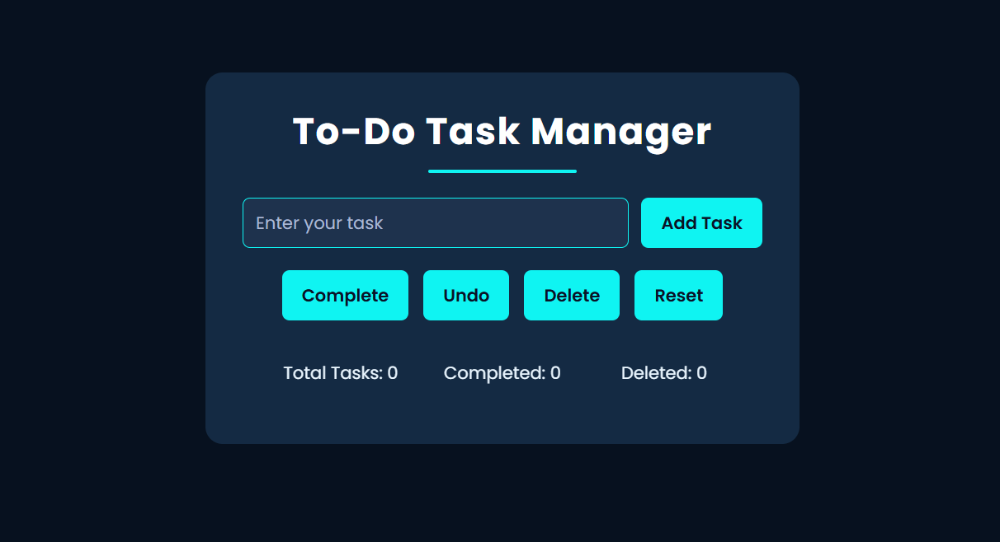

📌 To-Do Task Manager

A modern, responsive, and feature-rich To-Do application built using HTML, CSS, and JavaScript.
This app helps users manage daily tasks with an intuitive UI, smooth animations, and smart task controls.

🌟 Features

✨ Add new tasks easily  
✔ Mark tasks as completed  
↺ Undo completed tasks  
🗑 Delete selected tasks  
🔄 Reset entire list instantly  
📦 Auto-save tasks using LocalStorage  
🚫 Prevents duplicate task entries  
⌨ Press Enter to add tasks quickly  
📱 Fully responsive for all devices  
🎨 Neon-themed modern UI design  
🔍 Hover effects + interactive visuals  

🧠 How It Works

- All tasks are stored in Local Storage, so your list stays safe even after refreshing or closing the browser.
- Completed tasks get a line-through and faded appearance for clarity.
- Undo restores the task to its normal state.
- Statistics update automatically, including:
   - Total tasks added
   - Completed tasks
   - Deleted tasks

🛠️ Technologies Used

- HTML5 → Structure & content
- CSS3 → Styling, animations, responsive design
- JavaScript (ES6) → Logic, event handling, LocalStorage
